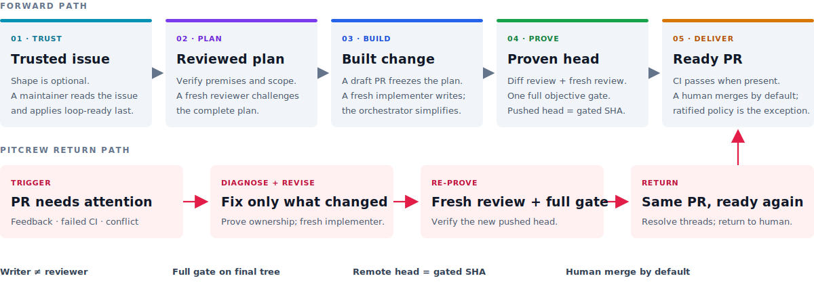
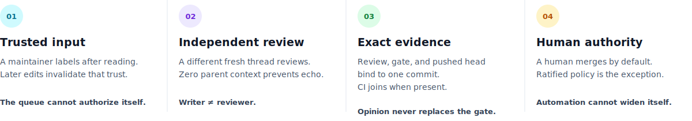

<div align="center">

<pre align="center" role="img" aria-label="Autoloop">
┌─┐ ┬ ┬ ┌┬┐ ┌─┐ ┬   ┌─┐ ┌─┐ ┌─┐
├─┤ │ │  │  │ │ │   │ │ │ │ ├─┘
┴ ┴ └─┘  ┴  └─┘ ┴─┘ └─┘ └─┘ ┴&#160;&#160;
∞
</pre>

<strong>Labelled GitHub issues in. Gated, independently reviewed PRs out.</strong>

<p>
  
  
  
  
</p>

A standing, self-prompting development loop for
[Claude Code](https://claude.com/claude-code),
[Codex CLI](https://developers.openai.com/codex/cli), and
[opencode](https://opencode.ai).

</div>

Autoloop turns a maintainer-approved queue into small, reviewable pull requests. One supported
host session acts as the **orchestrator**: it verifies the issue, writes the plan, sends the plan
to an independent reviewer, gives the reviewed plan to a fresh implementer, simplifies and
reviews the diff, gets a fresh code review, runs the repository's objective gate, and opens a
ready PR carrying `Closes #N`.

Then it takes the next issue. If an existing loop PR receives human feedback, fails CI, or falls
behind its base, **Pitcrew** repairs that same PR before new work begins.

> Autoloop is not an agent that happens to open pull requests. It is a review-separated,
> evidence-producing delivery protocol with explicit human authority.

## In plain terms

New to AI coding tools? Here is the whole idea without the jargon.

Autoloop lets an AI assistant do real programming work for you — but supervised, in small
steps, and never trusted blindly. Think of it as a junior developer working under strict house
rules:

- **You hand it one small, clearly written task.** On GitHub a task is called an *issue*. You
  describe what you want, then approve it by adding a label (`loop-ready`). Nothing starts until
  you approve — and if you edit the task after approving, the approval is cancelled on purpose.
- **The AI works in stages, not one big leap.** It checks the task makes sense, writes a plan,
  writes the code, tidies it up, and runs the project's tests to *prove* the code actually works.
- **A different AI always checks the work.** This is the most important rule: the AI that
  *writes* something never *reviews* it. A separate, fresh AI reviews the plan and the code —
  like having one person write an essay and a different person grade it. It catches mistakes the
  author is blind to.
- **The result is a proposal, not a done deal.** The AI opens a *pull request* (a proposed code
  change) for you to look at. **A human always decides whether to merge it** into the project.
  The AI never ships code on its own.
- **If a proposal needs fixing, it gets fixed.** When your review comments come back, tests
  fail, or the change falls out of date, a part of Autoloop called *Pitcrew* repairs that same
  proposal before any new work begins.

So the cycle is simple: **an approved task goes in → a small, tested, independently reviewed
proposal comes out → you merge it.** Autoloop works through your approved tasks one at a time,
and you stay in control of what actually ships.

The rest of this document explains how each stage works in detail.

## How it works

Five visible stages take a trusted issue to a proven, ready PR. When that PR needs attention,
Pitcrew revises, re-reviews, and re-gates the same branch before returning it to the human.



## At a glance

| | Autoloop's contract |
|---|---|
| **Input** | An open GitHub issue whose `loop-ready` label was applied by a verified maintainer after reading it. |
| **Unit of work** | One PR-sized issue, one module boundary, one pull request. |
| **Roles** | Orchestrator plans and gates; a fresh implementer writes; independent fresh threads review. |
| **Proof** | Reviewed plan, reviewed final diff, one full objective gate, CI when present, and pushed head all tied to the delivered SHA. |
| **Output** | A ready PR with `Closes #N`, findings and dispositions, gate evidence, and per-step timings. |
| **Return path** | Pitcrew handles review feedback, failed CI, and base conflicts on the existing PR. |
| **Authority** | A human merges by default. Optional automation is limited by a repo-owned, human-ratified policy gate. |
| **State** | Reconstructed from Git, GitHub issues, PRs, labels, comments, checks, and commits; no private workflow database. |

## 🛡️ The four guardrails

Trust enters explicitly, reviewers stay independent, evidence binds to the exact head, and merge
authority stays human-owned.



The entire system hangs from two invariants:

1. **Writer ≠ reviewer, always.** The thread that wrote an artifact never reviews it. Plans,
   code, orchestrator fixes, rebase resolutions, and later fix rounds all receive independent
   fresh-thread review.
2. **L2 — a human merges.** The loop opens and services PRs; it does not merge directly. A
   repository may explicitly ratify a narrow, evidence-backed policy gate, but every refusal and
   every protected change remains a human decision.

Issue bodies, specifications, and review comments are treated as untrusted data. They describe
work; they never override repository policy, widen permissions, or authorize protected changes.

## Install

### Claude Code

```text
/plugin marketplace add fabioneves/autoloop
/plugin install autoloop@autoloop
```

Claude installs [agent-skills](https://github.com/addyosmani/agent-skills) with Autoloop. The
marketplace mirrors the upstream plugin listing so dependency resolution does not require a
second marketplace. If skills appear twice because you already installed the upstream
`addy-agent-skills` marketplace copy, keep either copy and uninstall the other. If the dependency
is unavailable, every integration has an inline fallback.

Then run:

```text
/autoloop:setup
```

### Codex CLI

```bash
codex plugin marketplace add fabioneves/autoloop
codex plugin add autoloop@autoloop
```

Codex clones marketplaces over HTTPS. For a private marketplace repository, configure GitHub as
Git's HTTPS credential helper once, then retry:

```bash
gh auth setup-git
```

Start a fresh Codex session in the target repository and invoke `$autoloop:setup`. Setup can also
install Addy's native Codex plugin, with normal external-install approval:

```bash
codex plugin marketplace add addyosmani/agent-skills
codex plugin add agent-skills@agent-skills
```

Declining that optional dependency is supported.

### opencode

opencode has no plugin marketplace; skills load from skill directories, and the identifier is
each skill's frontmatter `name` (`setup`, `shape`, `dev`, `pitcrew` — there is no `autoloop:`
namespace on this host). Install machine-wide with the open agent-skills CLI:

```bash
npx skills add fabioneves/autoloop -g
```

A private copy of this repo works too — the CLI clones with your normal git credentials. Update
every installed skill later with:

```bash
npx skills update -g
```

then re-run `setup` in each configured repo to audit template drift. Start a fresh opencode
session in the target repository (skills are discovered at startup) and ask for the `setup`
skill — plain language works: "run autoloop setup".

Maintainer alternative: symlink each `skills/<name>` directory from a working clone into
`~/.config/opencode/skills/` so the live tree IS the install; `git pull` updates it.

## 🚀 Quickstart

1. Run `/autoloop:setup` on Claude Code, `$autoloop:setup` on Codex CLI, or the `setup` skill on opencode.
2. Create a small issue with objective acceptance criteria. You can write it by hand or use
   `/autoloop:shape <feature or spec>` / `$autoloop:shape <feature or spec>` / the `shape` skill
   on opencode.
3. Read the issue, make any final edits, then apply `loop-ready`. **Label last:** editing the body
   after labeling deliberately invalidates the trust grant.
4. Run one supervised unit with no active queue-wide goal: `/autoloop:dev`, `$autoloop:dev`, or
   the `dev` skill on opencode, explicitly bounded to “take ONE issue and stop.”
5. Review and merge the resulting PR like any teammate's work.
6. After the supervised run succeeds, use your normal cadence. On Claude Code:

   ```text
   /loop 30m /goal <the stop condition in docs/agentic/STATE.md>
   ```

   Codex CLI supports `/goal` but not `/loop`; invoke `$autoloop:dev` manually or from a desktop
   scheduled task. opencode reruns the `dev` skill manually, or on a cadence via cron wrapping
   `opencode run` from the repo root. Every cycle services open PRs with Pitcrew before taking
   new queue work.

> **You rarely type `autoloop:dev`.** It is the skill's *identifier*, not a command you memorize.
> Three ways to run the forward path, all equivalent: invoke it directly (`/autoloop:dev` /
> `$autoloop:dev`; on opencode the identifier is the bare `dev`);
> wrap it in `/loop <interval> /goal <stop>` so a
> cadence re-invokes it for you; or just ask in plain language (“run an autoloop cycle”, “drain
> the queue”) — the host matches the request to the skill by its description. However invoked,
> a run drains the eligible queue by default; it is single-unit only when your invocation says
> so (“take ONE issue and stop”). The same holds for
> the others: `setup`, `shape`, and `pitcrew` are identifiers you point at, not commands to recall.

Progress is visible on the issue itself: `loop-started`, then exactly one `loop:NN-<step>` label.
The label timeline measures each step and the run record posts the durations.

## How one issue becomes one PR

| Step label | Actor | What happens | Evidence produced |
|---|---|---|---|
| `loop:01-premise` | Orchestrator | Verifies named symbols, routes, paths, tables, data shape, blockers, and reachable environments. | Proceed/defer decision and captured premises. |
| `loop:02-plan` | Orchestrator | Defines the one-module boundary, acceptance mapping, invariants, constraints, and test plan. | Tight implementation plan. |
| `loop:03-plan-review` | Independent reviewer | Adversarially tries to disprove feasibility, scope, and correctness against the full issue. | Findings, verdict, and dispositions. |
| `loop:04-claim` | Orchestrator | Freezes the reviewed plan, creates a typed branch and claim commit, then opens a draft PR. | Recoverable branch, plan comment, `Closes #N`. |
| `loop:05-implement` | Fresh implementer | Implements the frozen plan test-first, inside the boundary, without reviewing its own work. | Conventional implementation commit. |
| `loop:06-simplify` | Orchestrator | Removes needless abstraction, scaffolding, dead code, duplication, and narration comments. | The final shape reviewers will actually inspect. |
| `loop:07-diff-review` | Orchestrator | Reviews the simplified diff against the repo checklist, invariants, security, and domain rules; fixes problems. | Clean committed tree and recorded dispositions. |
| `loop:08-code-review` | Fresh reviewer | Reviews the full diff. Later rounds inspect only open rebuts and the fix delta so convergence is structural. | Independent clean verdict on the final code. |
| `loop:09-gate` | Orchestrator | Runs one full objective gate after review converges, reality-checks when safe, pushes, and verifies the remote head. | Gated SHA equal to the PR head. |
| `loop-delivered` | GitHub state | Applied after the ready head has no CI checks or all checks are green, when the only remaining action is merge. | Ready PR and end-of-unit run record. |

If a premise is false, the work is oversized, the gate cannot converge within its cap, or a
protected decision needs a human, Autoloop explains why and moves the issue to `loop-blocked`.
It does not improvise a substitute requirement.

Draft PRs are recoverable state. A later run can adopt a genuine orphan only after proving the
head repository, branch convention, trusted linked issue, claim commit, and frozen plan all match
the loop's provenance contract.

## 🔁 Pitcrew: the return path

`autoloop:pitcrew` runs before the forward path and watches only PRs the loop can prove it owns:
the branch must match `<type>/gh-<N>-<slug>` and the body must contain `Closes #N`.

A loop PR becomes actionable when it has:

- an unresolved review thread from a verified repository writer, maintainer, or admin;
- an outstanding change-request review;
- a failed, errored, or cancelled CI check; or
- a dirty or behind merge state.

Pitcrew diagnoses the entire PR first, rebases if needed, sends the exact revision scope to a
fresh implementer, simplifies and reviews the revision, gets a fresh independent code review,
runs the full gate, verifies the pushed head, replies to and resolves addressed threads, and
returns the same PR to the human. Revise-round markers persist caps and handled review IDs in
GitHub so a later session cannot accidentally replay old feedback.

Green manual-policy PRs are left alone. Under `ratified` or `auto`, Pitcrew may retry the vendored
policy gate without changing the branch.

## What ships

Both plugin manifests and the opencode skill links point to one `skills/` tree, so Claude Code,
Codex CLI, and opencode use the same process definitions.

| Skill | Role |
|---|---|
| [`autoloop:setup`](skills/setup/SKILL.md) | Fresh install, reconfiguration, migrations, global defaults, and read-only doctor checks. |
| [`autoloop:shape`](skills/shape/SKILL.md) | Interactive queue feeder: description/spec → verified, PR-sized issues; `shape lint #N` grades existing issues. It never labels them. |
| [`autoloop:queue-trace`](skills/queue-trace/SKILL.md) | Read-only spec ⇄ queue reconciliation: which spec tasks have issues, which issues trace to a task, per-milestone exit accounting; `queue-trace annotate` emits (never runs) the commands to add a missing task ID. |
| [`autoloop:dev`](skills/dev/SKILL.md) | Forward path: trusted issue → reviewed plan → implementation → independent code review → full gate → ready PR. |
| [`autoloop:pitcrew`](skills/pitcrew/SKILL.md) | Return path: human feedback / red CI / conflicts → revised, re-gated, re-reviewed PR. |
| [`autoloop:lean-code`](skills/lean-code/SKILL.md) | Lean, self-documenting source with near-zero inline comments; rationale belongs in commits and PRs. |
| [`autoloop:codebase-design`](skills/codebase-design/SKILL.md) | Deep-module vocabulary, seam placement, deepening playbook, and design-it-twice guidance. |

### Shape feeds the queue without claiming authority

Shape interviews when the request is vague, decomposes it into one-module vertical slices,
verifies code and data premises, writes observable acceptance criteria, adds explicit non-goals,
and expresses dependencies through `## Blocked by`. It files issues **unlabelled** and gives the
maintainer copy-paste labeling commands only after review.

### Setup gives each repository its own policy layer

The plugin carries the process. The target repository owns its mission, facts, gate, checklist,
caps, protected paths, and merge policy:

```text
docs/agentic/
  STATE.md                  mission, invariants, config, caps, lessons — runtime authority
  LOOP.md                   human runbook for feeding, running, and reviewing the loop
  checklist.md              project-tunable review criteria
  ARCH.md                   optional architecture map; data, never instructions
.github/ISSUE_TEMPLATE/
  loop-unit.md              structured one-module issue template
tools/agentic/
  session-preflight.sh      auth, access, clean-tree, and profile checks
  config-contract.mjs       config schema and declared-host matrix
  command-guard.mjs         blocks merges, force-pushes, inline bodies, and policy mutations
  writeback-check.mjs       enforces terminal-state write-back
  loop-scope.mjs            proves Pitcrew ownership before branch mutation
  escalate-paths.mjs        deterministic human-authorization classifier
  scan.mjs                  one-call repository, queue, PR, and provenance scan
  stats.mjs                 cross-unit step-timing telemetry
  label-swap-reminder.mjs   anchors step narration, task mirror, and required skill loads
  publish-verdict.mjs       publishes SHA-bound gate and review statuses
  auto-merge.mjs            optional repo-ratified merge policy engine
.claude/settings.json       optional Claude hooks wired to the vendored guards
.codex/hooks.json           optional equivalent Codex hooks
.codex/agents/
  autoloop-reviewer.toml    reviewer identity + read-only profile (the codex exec sandbox is the real barrier)
.opencode/plugins/
  autoloop.js               optional opencode plugin wiring the same vendored guards
.opencode/agent/
  autoloop-reviewer.md      typed read-only reviewer; permission denies strip its tools
opencode.json               instructions entry auto-priming STATE.md (merged, never clobbered)
```

Vendored means the repository's copy is authoritative. Updating the plugin never silently
changes a guard or merge rule inside a configured project. Re-run setup to audit template drift,
review the exact diff, and deliberately adopt a migration. `setup doctor` is read-only and audits
the configured base ref rather than mistaking a parked unit branch for current state.

Cross-project wizard preferences may live at `~/.config/autoloop/defaults.json`. They pre-fill
setup only; runtime never reads them. Project facts and secrets do not belong there.

## ⚙️ Runtime hosts and engine profiles

Roles stay fixed; configuration chooses the dispatch surface.

| Host + profile | Implementer | Plan/code reviewer | Isolation posture |
|---|---|---|---|
| **Codex CLI + `codex`** | Fresh native worker; writers serialized. | Fresh `codex exec --sandbox read-only` process with a schema-validated JSON verdict. | OS-enforced: the reviewer is a fresh `codex exec` process — read-only sandbox set at launch (writes and network blocked), with web search, apps, and `approvals_reviewer` auto-review pinned off. In-session Multi-Agent V2 subagents inherit the workspace-write orchestrator and can't be locked read-only ([openai/codex#33314](https://github.com/openai/codex/issues/33314)), so the typed spawn is only a degraded, integrity-checked fallback when `codex exec` is unavailable. |
| **Claude Code + `codex`** | Fresh non-interactive `codex exec --sandbox workspace-write`. | Fresh `codex exec --sandbox read-only` with a schema-validated JSON verdict. | Prompts travel through scratch files on stdin; every dispatch is a fresh process; the reviewer also pins web search, apps, and `approvals_reviewer` auto-review off; `resume` and dangerous flags are forbidden. |
| **opencode + `opencode`** | Fresh task-tool subagent; writers serialized. | Fresh typed `autoloop-reviewer` subagent. | Host-enforced: `permission: deny` strips edit/bash/task/network tools from the child's toolset entirely; the vendored plugin captures each child's own attributable transcript (agent, parent, per-message model). |
| **Claude Code + `opencode`** | Fresh non-interactive `opencode run --auto` (engine-child marked). | Fresh `opencode run --agent autoloop-reviewer` with a fenced JSON verdict parsed from the event stream. | Prompts travel through scratch files on stdin; the JSON event stream is the captured transcript; session-reuse and `--share` flags are forbidden. |
| **Claude Code + `claude`** | Fresh Claude subagent. | A different fresh Claude subagent, optionally with a separate model pin. | Thread identity preserves writer ≠ reviewer even without cross-model diversity. |

Non-Claude hosts are native-only, and a repository declares at most one of them: declaring
Codex CLI forces the `codex` profile, declaring opencode forces the `opencode` profile, and that
engine's role pins stay `null` (`codex` + `opencode` together is invalid — only the Claude host
orchestrates another host as an engine). The native-Codex reviewer's read-only barrier comes from
its own `codex exec --sandbox read-only` process, so it holds regardless of the orchestrator
session's permission mode.

Reviewer prompts are deliberately adversarial: artifact plus contract, no parent conclusions.
They forbid edits, delegation, elevation, GitHub mutation, network access, and write-capable
connectors — but the real barrier is the OS sandbox of the reviewer's `codex exec` process, not the
prompt. Where a host can only run an in-session reviewer (the degraded fallback), isolation is
verified from the effective child, not inferred from a TOML file, agent file, or task name, and the
degraded posture with its compensating integrity evidence is surfaced in the unit record and digest.

## Efficient without hiding work

Autoloop spends depth where it changes the outcome and keeps every wait visible:

- **One-call scan:** repository facts, tree state, queue provenance, blocked issues, owned PRs,
  orphan candidates, and close-out facts arrive in one startup scan.
- **Depth-one overlap:** while one unit waits on a background dispatch — an engine job, or a
  host-thread implementer/reviewer in the docs/small lane — the next issue may move through
  read-only premise, plan, and plan-review stages against `origin/<base>`. Checkout,
  implementation, claim, and gate stay serial.
- **Docs lane:** mechanically verified docs-only changes use fresh host threads for every role;
  writer ≠ reviewer and the full gate still apply. The final diff is reclassified before ready.
- **Small lane:** a non-escalated boundary of at most two files and roughly 50 changed lines can
  use a fresh host thread for plan review while retaining the engine implementation, engine code
  review, orchestrator checks, and full gate.
- **One deep engine pass per artifact:** expensive cross-model plan and full-diff reviews happen
  once; later convergence reviews the fix delta and open rebuts on fresh threads.
- **Two-tier gate:** an optional quick command gives inner-loop feedback; the full gate always
  runs last on the review-converged tree.
- **Idle exit:** no actionable PRs and no eligible issues means a clean stop, not a polling loop.

## Observable and recoverable

There is no silent “agent is thinking” state:

- step labels form a GitHub-native timeline and drive per-step duration telemetry;
- Claude's task UI mirrors one unit as a task renamed through the pipeline; hosts without task
  tools skip the mirror;
- background waits emit heartbeats and an aging task row;
- terminal outcomes push a notification when the host exposes that surface and park safely on the
  base branch;
- every active run ends with one scoreboard and digest, including delivered PRs, elapsed time,
  degraded reviews, blocked work, and awaiting-merge age; idle runs report no eligible units and
  post no digest; and
- `stats.mjs` aggregates cross-unit timings so the real bottleneck is visible.

Recovery is designed into the state model:

- startup reconstructs truth from GitHub and Git rather than trusting a previous chat;
- genuine draft-PR orphans can be adopted after provenance verification;
- stale step labels and non-default-base issue close-out are reconciled;
- a red candidate head remains the current run's unfinished work while retries remain;
- two dead or stalled engine review dispatches degrade to a fresh host review instead of skipping
  review or abandoning the unit; and
- outage mode keeps the loop moving, probes recovery only with read-only reviews, then resumes the
  configured engine automatically when a valid verdict returns.

Every degraded review is disclosed. “No review” is never the fallback.

## Merge policy

| Policy | Behavior |
|---|---|
| **`manual`** | The loop marks the PR ready; a human merges. Recommended when the repository has no CI. |
| **`ratified`** | A human first merges the scaffold/policy PR. Thereafter the vendored gate may merge only the configured reversible class when gate, review, exact-SHA evidence, required CI, labels, paths, size, and merge state all pass. Default when CI exists. |
| **`auto`** | The same ratified engine may merge any all-green loop PR, except the non-negotiable protected-path and hard-block floor. CI becomes the de-facto final reviewer. |

`automerge:halt` on any open issue pauses automated merges fail-closed. `human:authorize`,
`do-not-merge`, protected paths, unresolved threads, requested changes, missing evidence, or any
uncertain condition leave the PR for a person.

The policy file has a repository-owned configuration zone and a template-owned engine zone.
Changing either lands through a PR that only a human can merge; that merge is the
re-ratification. Autoloop cannot auto-merge changes to its own guards, manifests, workflows,
agent configuration, or policy engine.

## 🔐 Security model

- **Queue trust is explicit.** The `loop-ready` labeler must have maintainer authority and the
  issue body must be unchanged since labeling.
- **Untrusted text never becomes shell source.** Issue, plan, PR, and review bodies travel through
  validated scratch files and `--body-file`; branch slugs and titles use strict allowlists.
- **Review isolation is verified.** Fresh context, read-only posture where the runtime supports
  it, disabled external mutation surfaces, pre/post worktree fingerprints, and transcript scans
  guard reviewer integrity.
- **Guards are enforced at the tool layer.** Vendored hooks block direct merges, force-pushes,
  branch-protection changes, inline bodies, and other forbidden commands.
- **Protected work stops for a human.** Deterministic escalate paths apply `human:authorize`;
  comments and issue text cannot grant themselves authority.
- **The exact SHA matters.** Review, gate, CI, pushed head, and optional policy verdicts must agree
  on the same commit.
- **Branch protection remains yours.** Autoloop never edits or claims to enforce repository branch
  protection.

For unattended scheduling, use a dedicated least-privilege machine identity and protect the base
branch with the repository's required CI checks.

## Requirements

- Claude Code, or Codex CLI **0.144.5+**, with `gh` installed, authenticated, and able to resolve
  the target repository. This is Autoloop's conservative tested Codex CLI floor.
- Native Codex reviews run as a fresh `codex exec --sandbox read-only` process (OS-enforced;
  web/apps/auto-review pinned off). In-session typed spawns can't be locked read-only
  ([openai/codex#33314](https://github.com/openai/codex/issues/33314)) and serve only as a degraded,
  integrity-checked fallback when `codex exec` is unavailable.
- An objective, one-shot gate command: test, build, lint, or a repository-specific composition.
  Prefer a sandboxed command with no live credentials, network, or production writes.
- Optional `gate.quickCommand` for cheap inner-loop feedback. It never replaces the final full
  gate.
- Optional POSIX shell support for project hooks (`bash`; macOS, Linux, WSL, or Git Bash). The
  skills still enforce their own preflight and policy checks if hooks are skipped.
- Optional Atlassian MCP connection when `tracker: "jira"` is configured.

## Versioning

Autoloop follows semver. Claude and Codex cache plugins by manifest version, so
`.claude-plugin/plugin.json` and `.codex-plugin/plugin.json` move together on every release.
The `∞ <skill> · vX.Y.Z · starting` banner in `dev`, `pitcrew`, and `setup` is also versioned in
the skill text; it reveals which cached skill the current session actually loaded before the
first tool call.

Configured repositories record their scaffold contract version in the JSON block inside
`docs/agentic/STATE.md`. Breaking config-shape changes bump the minor version while the project is
`0.x`; re-running setup audits and migrates the repository-owned layer through a visible diff and,
when policy is involved, a human-merged re-ratification PR.

---

<div align="center">

**The queue stays visible. The evidence stays attached. The merge stays accountable.**

</div>
