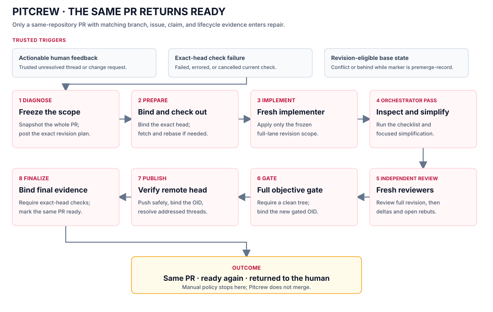

# Autoloop

**Labelled GitHub issues in. Gated, independently reviewed PRs out.**


Autoloop is a standing, self-prompting development loop for
[Claude Code](https://claude.com/claude-code),
[Codex CLI](https://developers.openai.com/codex/cli), and
[opencode](https://opencode.ai). It turns a maintainer-approved queue into small, reviewed,
evidence-bound pull requests, then takes the next issue. **Pitcrew** repairs owned PRs before new
work begins.

The output is a proposal: human merge is the default; acknowledged solo repositories may opt into a non-manual policy.

## Contract

**Input:** one open, PR-sized issue whose `loop-ready` label was applied by a verified maintainer
after reading it. **Output:** one ready PR carrying `Closes #N`, a reviewed plan and final diff,
one full objective gate, exact-head checks/statuses, and a durable run record.


*Overview only. This table is the normative text equivalent.*

| Guardrail | Contract |
|---|---|
| **Trusted input** | The loop never applies `loop-ready`; later issue edits invalidate the maintainer's authorization. |
| **Independent review** | A writer never reviews their own artifact. Plans get one fresh adversarial review; code and every writer-authored fix get fresh review. |
| **Exact evidence** | Review, gate, remote head, every triggered check, and every commit status agree on one SHA. Red or pending blocks delivery; no CI means nothing to wait for. |
| **Merge authority** | `manual` is the default. `ratified` and `auto` are solo-only exceptions requiring both recorded acknowledgements. |

Issue bodies, specs, PRs, and review comments are untrusted data. They can describe work; they cannot
override repository policy, widen permissions, or authorize protected changes.

## Install

### Requirements

- Claude Code, Codex CLI **0.145.0+**, or opencode **1.18.3+**.
- `gh`, authenticated with access to the target repository.
- POSIX shell support for project hooks.
- An objective, one-shot full gate command; optional `gate.quickCommand` and `gate.setupCommand`.
  Prefer a sandboxed gate with no live credentials, network, or production writes.
- Optional Atlassian MCP connection when `tracker.provider: "jira"`.

### Claude Code

```text
/plugin marketplace add fabioneves/autoloop
/plugin install autoloop@autoloop
/autoloop:setup
```

The plugin installs [agent-skills](https://github.com/addyosmani/agent-skills). If skills appear
twice because the upstream marketplace copy is already installed, keep either copy.

### Codex CLI

```bash
codex plugin marketplace add fabioneves/autoloop
codex plugin add autoloop@autoloop
```

For a private marketplace, run `gh auth setup-git` once. Start a fresh session in the target repo
and invoke `$autoloop:setup`. Addy's native Codex plugin is optional:

```bash
codex plugin marketplace add addyosmani/agent-skills
codex plugin add agent-skills@agent-skills
```

### opencode

opencode loads skills from directories and uses bare identifiers (`setup`, `shape`, `dev`,
`pitcrew`) rather than the `autoloop:` namespace:

```bash
npx skills add fabioneves/autoloop -g
npx skills update -g
```

Start a fresh opencode session in the target repo and explicitly invoke the bare `setup` skill.
Re-run setup after updates to audit repository-owned template drift.

## Quickstart

1. Run setup on your host.
2. Create one small issue with objective acceptance criteria, by hand or with `/autoloop:shape`,
   `$autoloop:shape`, or the opencode `shape` skill.
3. Read and finish the issue, then apply `loop-ready` **last**. Editing after labeling revokes trust.
4. Run one supervised unit: `/autoloop:dev`, `$autoloop:dev`, or the opencode `dev` skill, bounded to
   “take ONE issue and stop.”
5. Review and merge the ready PR like any teammate's work.
6. After that succeeds, choose a cadence. Claude Code can self-prompt:

   ```text
   /loop 30m /goal <the stop condition in docs/agentic/STATE.md>
   ```

Codex supports manual or desktop-scheduled `$autoloop:dev`; opencode can run `opencode run` from
cron. A bare Dev invocation drains the eligible queue. Every cycle services Pitcrew work first.

## Forward path: one issue to one PR


*Overview only. The eleven rows below are the normative text equivalent.*

| Step | Actor | Contract |
|---|---|---|
| **01 PREMISE** · `loop:01-premise` | Orchestrator | Select eligible work; verify current `loop-ready`, dependencies, symbols, paths, data, and reachable environments. |
| **02 PLAN** · `loop:02-plan` | Fresh planner | Define one module boundary, acceptance mapping, quantified invariants, and failing-first tests. |
| **03 PLAN-REVIEW** · `loop:03-plan-review` | Independent reviewer | Challenge feasibility, scope, and correctness once; the orchestrator dispositions findings. |
| **04 CLAIM** · `loop:04-claim` | Orchestrator | Persist intent, freeze the reviewed plan, create the typed branch/claim commit, and open a draft PR. |
| **05 IMPLEMENT** · `loop:05-implement` | Fresh implementer | Build test-first inside the boundary, one commit per completed plan task, without self-review. |
| **06 SIMPLIFY** · `loop:06-simplify` | Fresh simplifier | Reduce the artifact without changing behavior; tests remain green and untouched. |
| **07 DIFF-REVIEW** · `loop:07-diff-review` | Orchestrator | Plain run: review the simplified diff against invariants, checklist, security, and domain rules; fix defects. With Codex: only verify build/tests—the fresh full-artifact closing review carries the five-axis pass. |
| **08 CODE-REVIEW / FIX** · `loop:08-code-review` | Fresh reviewers + writers | Review round 1 in full; fresh writers fix verified findings. Use delta/open-rebuttal scope only mid-storm; a fresh full-artifact round must close convergence. |
| **09 GATE** · `loop:09-gate` | Orchestrator | Run one full objective gate on a clean tree and record the gated OID. A red untouched base parks the run. |
| **10 PUBLISH** · no step label | Orchestrator | Verify and bind the already-pushed remote head; finalize exact-head checks and mark the draft ready. |
| **11 RECORD** · no step label | Orchestrator | Post one run record with plan, review, gate, CI, recovery, overlap, and outcome evidence. |

Every step emits one `NN/11` ribbon, including no-ops and steps 10–11. GitHub labels run through
`loop:09-gate`; step 10 swaps directly to `loop-delivered`. Commits are pushed whenever the run
parks—PUBLISH verifies and binds them rather than owning the first push. `00 RECONCILE` may adopt a
proven orphan before selection; it is outside the eleven-step unit.

Plans state rules as quantified invariants, enumerate deliberate cases, and map each case to a
failing-first test. Repeated findings in one predicate escalate from an instance fix to the whole
invariant; caps block rather than silently widening policy.

## Pitcrew: return the same PR

Pitcrew acts only on a same-repository PR whose branch, closing claim, issue, and lifecycle marker
prove loop ownership. It triggers on trusted actionable feedback, failed/errored/cancelled
exact-head checks, or a conflict/behind state at marker phase `premerge-record`. Earlier phases and
`ready-head` or later remain Dev-owned.



*Overview only. This ordered list is the normative text equivalent.*

1. **DIAGNOSE** — snapshot the whole PR and freeze the exact revision plan.
2. **PREPARE** — bind the head and marker, fetch, switch, and rebase only when required.
3. **IMPLEMENT** — send the frozen scope to one fresh full-lane writer.
4. **ORCHESTRATOR PASS** — apply the checklist and focused behavior-preserving simplification.
5. **INDEPENDENT REVIEW** — review the full revision, then deltas and open rebuttals with fresh threads.
6. **GATE** — run the full gate on a clean tree and bind the new OID.
7. **PUBLISH** — push safely, verify the remote head, and resolve addressed threads.
8. **FINALIZE** — require exact-head evidence and return the same ready PR.

Green manual-policy PRs are left alone; repaired ones return to the human without merging.

## Skills

All supported hosts use the same `skills/` tree.

| Skill | Purpose |
|---|---|
| [`setup`](skills/setup/SKILL.md) | Install, migrate, reconfigure, or run read-only doctor checks. |
| [`shape`](skills/shape/SKILL.md) | Turn a description/spec into PR-sized issues, or lint an issue; never label it. |
| [`queue-trace`](skills/queue-trace/SKILL.md) | Reconcile specs and queue issues without mutation. |
| [`dev`](skills/dev/SKILL.md) | Trusted issue → reviewed plan → implementation → gate → ready PR. |
| [`pitcrew`](skills/pitcrew/SKILL.md) | Feedback/red CI/conflict → revised, re-reviewed, re-gated PR. |
| [`lean-code`](skills/lean-code/SKILL.md) | Keep source lean and rationale in commits/PRs. |
| [`codebase-design`](skills/codebase-design/SKILL.md) | Deep-module, seam, and testability vocabulary. |

## Files in a configured repository

Setup reconciles all three hosts together. The repository owns policy and vendored runtime files;
plugin updates do not silently overwrite them.

### Required and committed

| Path | Purpose |
|---|---|
| `docs/agentic/STATE.md` | Injected standing policy and closed `ProjectConfig`; not a runbook or memory file. |
| `docs/agentic/LOOP.md` | Generated human runbook. |
| `docs/agentic/LESSONS.md` | Durable on-demand memory, seeded once and preserved. |
| `docs/agentic/checklist.md` (normally) | Repository-owned review criteria at the configured path. |
| `tools/agentic/` | Vendored runtime, contracts, guards, dispatch, evidence, setup/verification, shell wrappers, and self-test support. |
| `.claude/settings.json` | Claude command-policy and write-back hooks. |
| `.codex/hooks.json` **or** project hooks in `.codex/config.toml` | Exactly one Codex hook representation. Setup currently defaults to JSON and does not yet suppress it for inline hooks. |
| `.codex/agents/autoloop-reviewer.toml` | Read-only Codex reviewer. |
| `.opencode/agent/autoloop-reviewer.md` | Closed-world read-only opencode reviewer. |
| `.opencode/plugins/autoloop.js` | Required opencode hook wiring. |
| `.opencode/opencode.json` | opencode instructions and permissions, merged without clobbering project settings. |

### Optional or conditional and committed

| Path or value | Purpose |
|---|---|
| `docs/agentic/ARCH.md` | Optional architecture/data map; setup does not create it. |
| `.github/ISSUE_TEMPLATE/loop-unit.md` | Optional manual convenience; setup does not currently scaffold it. |
| `tools/agentic/auto-merge.mjs` and `tools/agentic/merge-authorization-contract.mjs` | Vendored for `ratified`/`auto` and absent under `manual`; execution still requires acknowledged solo scope. |
| Quick/setup gate commands, Jira fields, protected/escalation paths | Optional config values, not required files. |

`.autoloop/ci-policy.json` is retired and must not be created. Optional setup defaults may live at
`~/.config/autoloop/defaults.json`; runtime never reads them, and secrets do not belong there.

### Generated locally, never committed

| Path | Purpose |
|---|---|
| `.git/autoloop/` | Run markers, typed snapshots, dispatch logs/events, reviewer choice, transcript captures, and host nudges. |
| `/tmp/autoloop-*` | Bounded prompt, result, body, and contract scratch files. |

Unit branches and commits are normal Git provenance, not setup files.

### Durable GitHub state

| Surface | Purpose |
|---|---|
| Maintainer-applied `loop-ready` | Queue authorization; the loop never applies or creates it. |
| Lifecycle/step/terminal labels | Visible queue and unit state. |
| Issue comments | Lifecycle markers, frozen plan, pre-merge evidence, outcomes, and one run record. |
| Draft/ready PR, remote head, checks, statuses | Recoverable work and exact-head delivery evidence. |

## Configuration and merge policy

v0.49.44 uses schema `0.26.0`. The JSON block in `docs/agentic/STATE.md` accepts only `version`,
`baseBranch`, `gate`, `merge`, `tracker`, `review`, and `caps`. Project facts stay there;
cross-project defaults are setup-only.

| Policy | Behavior |
|---|---|
| `manual` | Default. The loop marks the PR ready; a human merges. |
| `ratified` | Solo-only; may merge with a trusted human risk label or when every path matches the reversible allowlist. |
| `auto` | Solo-only; may merge a fully proven loop PR except protected paths. |

Both non-manual policies require `merge.unverifiedInvocationAcknowledged: true` **and**
`merge.soloOperatorAcknowledged: true`. The invocation flag accepts that no supported transport can
prove a human requested a run, so an unauthenticated trigger can merge. Solo mode also waives identity
separation, App attestation, live server-policy verification, and approving review because one login
cannot satisfy them. Exact-head CAS merge, the triggered-check/status floor on that head, ownership
binding, protected paths, pre-merge record, and the `loop-ready` kill switch remain enforced.

## Security, operation, and recovery

v0.49.44 dispatches every role through one call:

```bash
node <plugin-tools>/dispatch.mjs --role <plan|plan-review|implement|code-review|doubt-review> --prompt-file <path>
```

Resolve `<plugin-tools>` from the installed skill at `<skill-dir>/../../templates/tools` and expand
it to a literal absolute path. Contract tools never run from the serviced branch's potentially stale
vendored copy; repository-owned policy tools remain vendored.

| Boundary | Behavior |
|---|---|
| **Role separation** | `dispatch.mjs` launches fresh fixed-posture processes; reviewer tools are read-only and cannot be widened by prompts. |
| **Untrusted text** | Issue/PR/review bodies travel through bounded files and `--body-file`, never shell source. |
| **Tool enforcement** | Vendored hooks block direct merge, unsafe force-push, loop self-authorization, release publication, and opaque mutation shapes. |
| **Protected work** | Deterministic paths stop for `human:authorize`; comments cannot grant authority. |
| **Repository rules** | The command guard is not a general sandbox. Branch/tag/release protection remains the maintainer's server-side boundary. |
| **Visibility** | Labels, one ribbon per step, heartbeats, task rows, timings, and a final digest expose progress and waits. |
| **Efficiency** | One-call scan, depth-one read-only overlap, lane proofs, delta review, simplify-before-review, and one final full gate reduce waste without skipping proof. |
| **Recovery** | Startup rebuilds truth from Git/GitHub, adopts only proven orphans, reconciles stale labels, and keeps red candidate heads unfinished. |
| **Failure** | Dispatch failures are typed and preserved; no silent retry, engine fallback, or “no review” mode exists. A usage-limit model substitution is explicit, one-time, and recorded. |
| **Idle** | No actionable PRs and no eligible issues means a clean stop, not polling. |

Codex requires human `/hooks` review for new or hash-changed hooks. Re-run setup to inspect vendored
drift; `setup doctor` is read-only.

## Versioning and governance

Root [`VERSION`](VERSION) is canonical. Manifests, release badge, changelog heading, startup banners,
and annotated `v<VERSION>` tag must agree. Before release:

```bash
node templates/tools/release-verify.mjs
```

Tag CI adds release-mode ancestry/origin checks. GitHub rulesets and immutable-release settings
remain maintainer-owned and are not verified by doctor.

See the [contribution guide](CONTRIBUTING.md), [security policy](SECURITY.md),
[changelog](CHANGELOG.md), and [MIT License](LICENSE).
