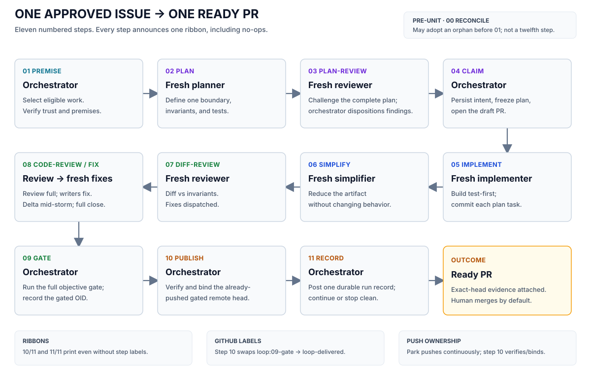
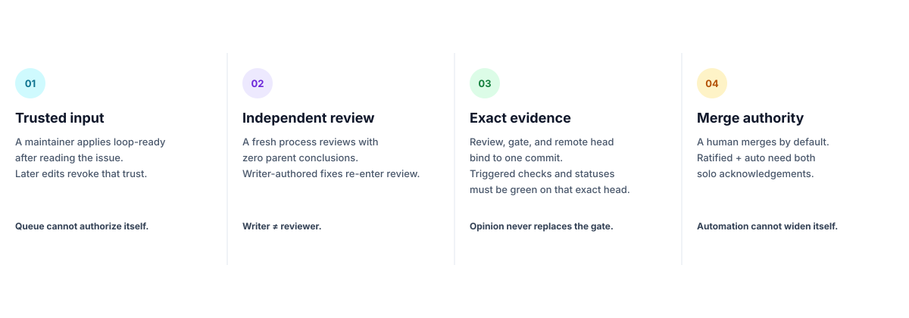

<div align="center">

<pre align="center" role="img" aria-label="Autoloop">
┌─┐ ┬ ┬ ┌┬┐ ┌─┐ ┬   ┌─┐ ┌─┐ ┌─┐
├─┤ │ │  │  │ │ │   │ │ │ │ ├─┘
┴ ┴ └─┘  ┴  └─┘ ┴─┘ └─┘ └─┘ ┴&#160;&#160;
∞
</pre>

<strong>Labelled GitHub issues in. Gated, independently reviewed PRs out.</strong>

<p>
  
  
  
  
</p>

A standing, self-prompting development loop for
[Claude Code](https://claude.com/claude-code),
[Codex CLI](https://developers.openai.com/codex/cli), and
[opencode](https://opencode.ai).

</div>

Autoloop turns a maintainer-approved queue into small, reviewable pull requests. One supported
host session acts as the **orchestrator**: it verifies the issue, writes the plan, sends the plan
to an independent reviewer, gives the reviewed plan to a fresh implementer, simplifies and
reviews the diff, gets a fresh code review, runs the repository's objective gate, and opens a
ready PR carrying `Closes #N`.

Then it takes the next issue. If an existing loop PR receives human feedback, fails CI, or falls
behind its base, **Pitcrew** repairs that same PR before new work begins.

> Autoloop is not an agent that happens to open pull requests. It is a review-separated,
> evidence-producing delivery protocol with explicit human authority.

## In plain terms

New to AI coding tools? Here is the whole idea without the jargon.

Autoloop lets an AI assistant do real programming work for you — but supervised, in small
steps, and never trusted blindly. Think of it as a junior developer working under strict house
rules:

- **You hand it one small, clearly written task.** On GitHub a task is called an *issue*. You
  describe what you want, then approve it by adding a label (`loop-ready`). Nothing starts until
  you approve — and if you edit the task after approving, the approval is cancelled on purpose.
- **The AI works in stages, not one big leap.** It checks the task makes sense, writes a plan,
  writes the code, tidies it up, and runs the project's tests to *prove* the code actually works.
- **A different AI always checks the work.** This is the most important rule: the AI that
  *writes* something never *reviews* it. A separate, fresh AI reviews the plan and the code —
  like having one person write an essay and a different person grade it. It catches mistakes the
  author is blind to.
- **The result is a proposal, not a done deal.** The AI opens a *pull request* (a proposed code
  change) for you to look at. **A human always decides whether to merge it** into the project.
  The AI never ships code on its own.
- **If a proposal needs fixing, it gets fixed.** When your review comments come back, tests
  fail, or the change falls out of date, a part of Autoloop called *Pitcrew* repairs that same
  proposal before any new work begins.

So the cycle is simple: **an approved task goes in → a small, tested, independently reviewed
proposal comes out → you merge it.** Autoloop works through your approved tasks one at a time,
and you stay in control of what actually ships.

The rest of this document explains how each stage works in detail.

## How it works

Five visible stages take a trusted issue to a proven, ready PR. When that PR needs attention,
Pitcrew revises, re-reviews, and re-gates the same branch before returning it to the human.



## At a glance

| | Autoloop's contract |
|---|---|
| **Input** | An open GitHub issue whose `loop-ready` label was applied by a verified maintainer after reading it. |
| **Unit of work** | One PR-sized issue, one module boundary, one pull request. |
| **Roles** | Orchestrator plans and gates; a fresh implementer writes; independent fresh threads review. |
| **Proof** | Reviewed plan, reviewed final diff, one full objective gate, CI when present, and pushed head all tied to the delivered SHA. |
| **Output** | A ready PR with `Closes #N`, findings and dispositions, gate evidence, and per-step timings. |
| **Return path** | Pitcrew handles review feedback, failed CI, and base conflicts on the existing PR. |
| **Authority** | `merge.policy: manual` by default; a human merges. A non-manual policy requires an explicit `merge.unverifiedInvocationAcknowledged: true`, because prompt hooks cannot prove a human requested the run. |
| **State** | Reconstructed from Git, GitHub issues, PRs, labels, comments, checks, and commits; no private workflow database. |

## 🛡️ The four guardrails

Trust enters explicitly, reviewers stay independent, evidence binds to the exact head, and merge
authority stays human-owned.



The entire system hangs from two invariants:

1. **Code writer ≠ code reviewer, always.** Code, orchestrator fixes, rebase resolutions, and
   later fix rounds receive independent fresh-context review. Plans receive one independent
   adversarial review; the orchestrator records and dispositions its findings before freezing the
   plan instead of starting a second plan-review round.
2. **L2 — a human merges by default.** The loop opens and services PRs. `ratified` and `auto` are
   rejected at run open unless the repository sets `merge.unverifiedInvocationAcknowledged: true`,
   recording that it accepts a trigger no supported transport can authenticate.

Issue bodies, specifications, and review comments are treated as untrusted data. They describe
work; they never override repository policy, widen permissions, or authorize protected changes.

## Install

### Claude Code

```text
/plugin marketplace add fabioneves/autoloop
/plugin install autoloop@autoloop
```

Claude installs [agent-skills](https://github.com/addyosmani/agent-skills) with Autoloop. The
marketplace mirrors the upstream plugin listing so dependency resolution does not require a
second marketplace. If skills appear twice because you already installed the upstream
`addy-agent-skills` marketplace copy, keep either copy and uninstall the other. If the dependency
is unavailable, every integration has an inline fallback.

Then run:

```text
/autoloop:setup
```

### Codex CLI

```bash
codex plugin marketplace add fabioneves/autoloop
codex plugin add autoloop@autoloop
```

Codex clones marketplaces over HTTPS. For a private marketplace repository, configure GitHub as
Git's HTTPS credential helper once, then retry:

```bash
gh auth setup-git
```

Start a fresh Codex session in the target repository and invoke `$autoloop:setup`. Setup can also
install Addy's native Codex plugin, with normal external-install approval:

```bash
codex plugin marketplace add addyosmani/agent-skills
codex plugin add agent-skills@agent-skills
```

Declining that optional dependency is supported.

### opencode

opencode has no plugin marketplace; skills load from skill directories, and the identifier is
each skill's frontmatter `name` (`setup`, `shape`, `dev`, `pitcrew` — there is no `autoloop:`
namespace on this host). Install machine-wide with the open agent-skills CLI:

```bash
npx skills add fabioneves/autoloop -g
```

A private copy of this repo works too — the CLI clones with your normal git credentials. Update
every installed skill later with:

```bash
npx skills update -g
```

then re-run `setup` in each configured repo to audit template drift. Start a fresh opencode
session in the target repository (skills are discovered at startup) and ask for the `setup`
skill — plain language works: "run autoloop setup".

Maintainer alternative: symlink each `skills/<name>` directory from a working clone into
`~/.config/opencode/skills/` so the live tree IS the install; `git pull` updates it.

## 🚀 Quickstart

1. Run `/autoloop:setup` on Claude Code, `$autoloop:setup` on Codex CLI, or the `setup` skill on opencode.
2. Create a small issue with objective acceptance criteria. You can write it by hand or use
   `/autoloop:shape <feature or spec>` / `$autoloop:shape <feature or spec>` / the `shape` skill
   on opencode.
3. Read the issue, make any final edits, then apply `loop-ready`. **Label last:** editing the body
   after labeling deliberately invalidates the trust grant.
4. Run one supervised unit with no active queue-wide goal: `/autoloop:dev`, `$autoloop:dev`, or
   the `dev` skill on opencode, explicitly bounded to “take ONE issue and stop.”
5. Review and merge the resulting PR like any teammate's work.
6. After the supervised run succeeds, use your normal cadence. On Claude Code:

   ```text
   /loop 30m /goal <the stop condition in docs/agentic/STATE.md>
   ```

   Codex CLI supports `/goal` but not `/loop`; invoke `$autoloop:dev` manually or from a desktop
   scheduled task. opencode reruns the `dev` skill manually, or on a cadence via cron wrapping
   `opencode run` from the repo root. Every cycle services open PRs with Pitcrew before taking
   new queue work.

> **`autoloop:dev` is the skill identifier.** Invoke it directly (`/autoloop:dev` /
> `$autoloop:dev`; on opencode the identifier is the bare `dev`), select that named skill in the
> host UI, or wrap the explicit identifier in `/loop <interval> /goal <stop>` so a cadence
> re-invokes it. Natural-language skill matching may help discovery, but Runtime does not infer
> a flow from unconstrained prose. A run drains the eligible queue by default; it is single-unit
> only when the invocation says so (“take ONE issue and stop”). The same holds for the others:
> `setup`, `shape`, and `pitcrew` are identifiers you point at, not commands to recall.

A bare Dev, Pitcrew, or doctor invocation selects the active host's native route. An explicit
selector is `with claude`, `with codex`, or `with opencode` and lasts only for the current run.
Supported cross-engine examples are `/autoloop:dev with codex` and
`/autoloop:pitcrew with opencode`. Same-UID prompt hooks cannot prove who supplied this preference,
so every v0.40 run records `intentProvenance: best-effort-unverified`. A selector is routing input,
not user attribution or elevated authority. An installed, authenticated selected engine is the
operator's standing authorization for its cost; fallback still requires independent capability
for the fallback engine. No STATE field, issue text, or prior run selects an engine.

Progress is visible on the issue itself: `loop-started`, then exactly one `loop:NN-<step>` label.
The label timeline measures each step and the run record posts the durations.

## How one issue becomes one PR

| Step label | Actor | What happens | Evidence produced |
|---|---|---|---|
| `loop:01-premise` | Orchestrator | Verifies named symbols, routes, paths, tables, data shape, blockers, and reachable environments. | Proceed/defer decision and captured premises. |
| `loop:02-plan` | Orchestrator | Defines the one-module boundary, acceptance mapping, invariants, constraints, and test plan. | Tight implementation plan. |
| `loop:03-plan-review` | Independent reviewer | Adversarially tries to disprove feasibility, scope, and correctness against the full issue. | Findings, verdict, and dispositions. |
| `loop:04-claim` | Orchestrator | Freezes the reviewed plan, creates a typed branch and claim commit, then opens a draft PR. | Recoverable branch, plan comment, `Closes #N`. |
| `loop:05-implement` | Fresh implementer | Implements the frozen plan test-first, inside the boundary, without reviewing its own work. | Conventional implementation commit. |
| `loop:06-simplify` | Orchestrator | Removes needless abstraction, scaffolding, dead code, duplication, and narration comments. | The final shape reviewers will actually inspect. |
| `loop:07-diff-review` | Orchestrator | Reviews the simplified diff against the repo checklist, invariants, security, and domain rules; fixes problems. | Clean committed tree and recorded dispositions. |
| `loop:08-code-review` | Fresh reviewer | Reviews the full diff. Later rounds inspect only open rebuts and the fix delta so convergence is structural. | Independent clean verdict on the final code. |
| `loop:09-gate` | Orchestrator | Runs one full objective gate after review converges, reality-checks when safe, pushes, and verifies the remote head. | Gated SHA equal to the PR head. |
| `loop-delivered` | GitHub state | Applied only when committed, reviewed, gated, remote, and CI evidence name the same head, the complete required-check set is either empty by policy or green, and the pre-merge record is durably bound. | Ready PR and end-of-unit run record. |

An empty CheckRun response is never a no-CI policy. Delivery reads canonical
`.autoloop/ci-policy.json` from both the exact checkout and the remote-head Git tree, derives the
complete required-check set itself, and rejects any caller list that differs. The policy file is a
human-authorized, merge-protected path; a loop PR cannot weaken its own delivery requirement.

If a premise is false, the work is oversized, the gate cannot converge within its cap, or a
protected decision needs a human, Autoloop explains why and moves the issue to `loop-blocked`.
It does not improvise a substitute requirement.

Draft PRs are recoverable state. A later run can adopt a genuine orphan only after proving the
head repository, branch convention, trusted linked issue, claim commit, and frozen plan all match
the loop's provenance contract.

## 🔁 Pitcrew: the return path

`autoloop:pitcrew` runs before the forward path and watches only PRs the loop can prove it owns:
the branch must match `<type>/gh-<N>-<slug>` and the body must contain `Closes #N`.

A loop PR becomes actionable when it has:

- an unresolved review thread from a verified repository writer, maintainer, or admin;
- an outstanding change-request review;
- a failed, errored, or cancelled CI check; or
- a dirty or behind merge state.

Pitcrew diagnoses the entire PR first, rebases if needed, sends the exact revision scope to a
fresh implementer, simplifies and reviews the revision, gets a fresh independent code review,
runs the full gate, verifies the pushed head, replies to and resolves addressed threads, and
returns the same PR to the human. Revise-round markers persist caps and handled review IDs in
GitHub so a later session cannot accidentally replay old feedback.

Green manual-policy PRs are left alone. v0.40 rejects `ratified` and `auto` at run open because its
prompt transport cannot authenticate invocation provenance.

## What ships

Both plugin manifests and the opencode skill links point to one `skills/` tree, so Claude Code,
Codex CLI, and opencode use the same process definitions.

| Skill | Role |
|---|---|
| [`autoloop:setup`](skills/setup/SKILL.md) | Fresh install, reconfiguration, migrations, global defaults, and read-only doctor checks. |
| [`autoloop:shape`](skills/shape/SKILL.md) | Interactive queue feeder: description/spec → verified, PR-sized issues; `shape lint #N` grades existing issues. It never labels them. |
| [`autoloop:queue-trace`](skills/queue-trace/SKILL.md) | Read-only spec ⇄ queue reconciliation: which spec tasks have issues, which issues trace to a task, per-milestone exit accounting; `queue-trace annotate` emits (never runs) the commands to add a missing task ID. |
| [`autoloop:dev`](skills/dev/SKILL.md) | Forward path: trusted issue → reviewed plan → implementation → independent code review → full gate → ready PR. |
| [`autoloop:pitcrew`](skills/pitcrew/SKILL.md) | Return path: human feedback / red CI / conflicts → revised, re-gated, re-reviewed PR. |
| [`autoloop:lean-code`](skills/lean-code/SKILL.md) | Lean, self-documenting source with near-zero inline comments; rationale belongs in commits and PRs. |
| [`autoloop:codebase-design`](skills/codebase-design/SKILL.md) | Deep-module vocabulary, seam placement, deepening playbook, and design-it-twice guidance. |

### Shape feeds the queue without claiming authority

Shape interviews when the request is vague, decomposes it into one-module vertical slices,
verifies code and data premises, writes observable acceptance criteria, adds explicit non-goals,
and expresses dependencies through `## Blocked by`. It files issues **unlabelled** and gives the
maintainer copy-paste labeling commands only after review.

### Setup gives each repository its own policy layer

The plugin carries the process. The target repository owns its mission, facts, gate, checklist,
caps, protected paths, and merge policy:

```text
.autoloop/
  ci-policy.json            canonical complete required-CheckRun policy
docs/agentic/
  STATE.md                  mission, ProjectConfig 0.25, caps, lessons — policy authority
  LOOP.md                   human runbook for feeding, running, and reviewing the loop
  checklist.md              project-tunable review criteria
  ARCH.md                   optional architecture map; data, never instructions
.github/ISSUE_TEMPLATE/
  loop-unit.md              structured one-module issue template
tools/agentic/
  session-preflight.sh      route-neutral auth, access, config, and clean-tree checks
  config-contract.mjs       ProjectConfig schema and explicit 0.24 → 0.25 migration
  runtime-contract.mjs      invocation intent, five-route catalog, dispatch and fallback policy
  route-adapter-contract.mjs typed attempt compilation and raw-evidence classification
  continuation-store.mjs    append-only, session-bound opencode relaunch recovery
  claim-contract.mjs        canonical branch/body loop-ownership grammar
  lane-contract.mjs         configured-base lane proofs and shared path policy
  snapshot-contract.mjs     complete-section, invalidation, and absence-safety rules
  lifecycle-contract.mjs    durable phase markers and idempotent reconciliation
  lifecycle-driver.mjs      stable-read lifecycle effects and revision epochs
  measurement-contract.mjs  authenticated raw cost records and strict cohort statistics
  release-verify.mjs        static release consistency and portable helpers
  verify.mjs                canonical installed contract and syntax verification
  contract-lint.mjs         stale routing and duplicate-grammar detection
  command-guard.mjs         blocks protected mutations plus opaque shell source and CLI aliases
  writeback-check.mjs       enforces terminal-state write-back
  loop-scope.mjs            proves Pitcrew ownership before branch mutation
  escalate-paths.mjs        deterministic human-authorization classifier
  scan.mjs                  one-call repository, queue, PR, and provenance scan
  stats.mjs                 presentation-only cross-unit step timings
  label-swap-reminder.mjs   anchors step narration, task mirror, and required skill loads
  publish-verdict.mjs       universal exact-head gate/check/premerge/ready/delivered finalizer
  auto-merge.mjs            dormant fail-closed reference policy engine
.claude/settings.json       mandatory Claude intent and command-policy hooks
.codex/hooks.json           mandatory equivalent Codex hooks
.codex/agents/
  autoloop-reviewer.toml    reviewer identity + defense-in-depth defaults
.opencode/plugins/
  autoloop.js               optional opencode plugin wiring the same vendored guards
.opencode/agent/
  autoloop-reviewer.md      closed-world reviewer; only in-worktree read/glob/grep/list survive
.opencode/opencode.json     instructions entry auto-priming STATE.md (merged, never clobbered)
```

The command guard hardens literal model-issued shell operations; it is not an arbitrary-program
sandbox. No-bypass repository rules remain the protected-branch enforcement boundary.

Codex requires a human `/hooks` review for every new or hash-changed project hook. Static
verification proves the definition and its vendored targets, not effective hash trust.

Vendored means the repository's copy is authoritative. Updating the plugin never silently
changes a guard or merge rule inside a configured project. Re-run setup to audit template drift,
review the exact diff, and deliberately adopt a migration. `setup doctor` is read-only and audits
the configured base ref rather than mistaking a parked unit branch for current state.

Setup reconciles the safe repository artifacts for Claude Code, Codex CLI, and opencode together.
Changing the active native host therefore needs no repository reconfiguration. Artifact presence
is capability evidence only; it does not opt a repository into a host or select a route.

Cross-project wizard preferences may live at `~/.config/autoloop/defaults.json`. They pre-fill
setup only; runtime never reads them. Project facts and secrets do not belong there.

## ⚙️ Runtime hosts and invocation routes

Roles stay fixed. A bare invocation means `native`; an explicit selector is preserved as a
best-effort captured routing preference. It is never described as a verified user request.
Historical records and capability results have zero route-selection authority. Only the selected
engine's installed authenticated capability supplies standing cost authority; fallback requires
its own independently authenticated capability.

v0.41.3 supports exactly five active-host/captured-preference pairs:

| Active host | Captured engine preference | Route | Live verification |
|---|---|---|---|
| Claude Code | Claude | Native Claude | verified |
| Codex CLI | Codex | Native Codex | verified |
| opencode | opencode | Native opencode | **untested** |
| Claude Code | Codex | Claude → fresh `codex exec` | verified |
| Claude Code | opencode | Claude → fresh `opencode run` | **untested** |

The other four host/engine pairs fail before mutation with `UNSUPPORTED_ROUTE`. An explicit
same-host selector resolves to the same native route while remaining explicit in the run record.
The same selection grammar applies to Dev, Pitcrew, and doctor.

The two OpenCode routes are statically verified but were not live-smoke tested against the v0.40.0
invocation contract; see [`docs/opencode-smoke.md`](docs/opencode-smoke.md). Selecting
`with opencode` runs an unverified route.

Native describes the host/engine relationship, not process topology. All five routes are fresh
broker-launched Linux processes: Claude print mode with structured output, `codex exec`, or
`opencode run --pure`. Every typed writer receives writable checkout files and read-only Git
metadata. After one valid complete typed result, the broker makes and verifies exactly one clean
offline commit whose sole parent is the sealed starting HEAD. The OpenCode model further receives
only checkout-scoped read/edit/glob/grep/list. Reviewers receive a read-only checkout. Each child
has a private home, IPC, `/run`, `/tmp`, `/var/tmp`, and `/dev`, closed selective runtime mounts,
and no unrelated host files. No process child receives GitHub CLI credentials, SSH keys/agents,
Git credential helpers, broker sockets, or other same-UID host IPC.

Reviewer prompts are adversarial: artifact plus contract, no parent conclusions. Route adapters
also enforce their actual isolation boundary, launch flags, prompt transport, verdict schema, and
capability checks. Every dispatch receipt binds `intentProvenance: "best-effort-unverified"` and
distinguishes the captured preference, selected and actual routes, observable model identity,
effective isolation, fallback, and degradation. Compatibility fields named `requestedEngine` and
`requestedRoute` do not imply a verified user request.

Runtime signatures come only from one process-bound, in-memory broker with a closed sequence
ledger and no generic signing operation. The broker alone compiles launches, captures stdout and
effects, and classifies the exact one-use attempt. An exact continuation target reuses that
broker/socket/PID. A durable prompt intent prepares that exact target; target Runtime open and the
persisted prompted transition may arrive in either order, and only both together revoke the source
run/session. A target stop that wins the race defers teardown until that transfer completes. The
target's terminal stop then removes the final broker authority. Process routes require a live
`host.process-authority-isolation` smoke using `/usr/bin/bwrap` on Linux. The wrapper creates fresh
PID, mount, home, `/run`, `/tmp`, `/var/tmp`, and `/dev` namespaces; mounts only the required
engine/toolchain/runtime paths, provider authentication material, checkout, and scratch; seals Git
configuration; and hides unrelated host files plus broker and host sockets. The trusted OpenCode
engine retains provider network/authentication for inference, but its model-callable tools expose
no shell, network, custom/MCP, credential, Git-metadata, or host-IPC path. No writer can
authenticate remote Git or GitHub operations. v0.40 does not support live process routes on macOS.

v0.40 live execution is Linux-only. On non-Linux hosts every route probe fails with
`UNVERIFIABLE_ISOLATION` before issuing an attempt challenge or creating probe scratch state,
because the supported hosts do not expose the required closed process-authority boundary
there. The two-phase native prepare/complete operations remain synthetic contract-test scaffolding
only; they are not an operational fallback. macOS CI verifies portable static contracts and does
not advertise a live route. All five closed routes remain available for verified live smoke on
Linux when their route-specific requirements pass.

## Efficient without hiding work

Autoloop spends depth where it changes the outcome and keeps every wait visible:

- **One-call scan:** repository facts, tree state, queue provenance, blocked issues, owned PRs,
  orphan candidates, and close-out facts arrive in one startup scan.
- **Depth-one overlap:** while one unit waits on a background dispatch, the next issue may move through
  read-only premise, plan, and plan-review stages against `origin/<base>`. Checkout,
  implementation, claim, and gate stay serial.
- **Docs lane:** mechanically proven docs-only work stays on the safe native route for plan review,
  implementation, and review; code writer ≠ code reviewer and the full gate still apply.
- **Small lane:** a mechanically proven non-escalated change uses native plan review, the selected
  route for implementation, then native first review after final-diff proof.
- **Full lane:** plan review, implementation, and first full-artifact review use the selected
  route. Later convergence uses the safe native route and reviews only the fix delta and open
  rebuts.
- **Two-tier gate:** an optional quick command gives inner-loop feedback; the full gate always
  runs last on the review-converged tree.
- **Idle exit:** no actionable PRs and no eligible issues means a clean stop, not a polling loop.

The versioned [measurement contract](docs/measurement.md) binds a Runtime-authenticated
`run-start` immediately after Runtime opens and before startup work, derives
unit/lane/capability/outage context from the broker's first exact plan, and
retains write-once raw stage, command, and Runtime receipt events under live HEAD/tool time and
local store authentication. Time to first selection includes the full pre-selection wall interval,
and each dispatch preserves its own effective lane so final-diff promotion remains visible.
Checkpoint identity remains declared rather than independently attested;
each record also binds the SHA-256 of its retained, versioned benchmark manifest as
`comparisonContextFingerprint` and a checkpoint-specific endpoint manifest as
`checkpointEndpointFingerprint`. Duplicate run/unit or terminal-evidence identities and invalid
evidence fail closed. A Git-ref CAS lock serializes publication and crash recovery across
processes. Unknown provider, model, token, context, cost, or avoided-cost evidence is typed
unavailable instead of zero. An independently reported provider unit total may remain observed
across missing segment telemetry only with `provider-unit-total` provenance whose closed raw
evidence binds the exact run, unit, metric, provider, and value; fully observed segments still
reconcile exactly.

Matched-checkpoint comparison is manual-to-manual. It holds workload, mode, comparison context, and
stage-independent role/route/adapter/degradation/provider/model/engine identities fixed while
requiring completed units and every provider/model/engine identity to be observed. Each checkpoint
has one revision, configuration, and stable endpoint; those values may differ across checkpoints.
Capability/outage facts may vary inside an endpoint but their exact value/count distributions stay
in every matched or unmatched report; unmatched sides retain the same per-checkpoint identity
checks. Mode/workload budgets load authenticated record IDs from the local store, require one
completed revision/endpoint per side with the same configuration and runtime identity, replay every
named safe-system fingerprint, and refuse or stay provisional below metric-specific floors.
Terminal, gate, lifecycle, and provider-accounting producer capture is not yet available, so live
v0.40 runs retain those references as typed unavailable and cannot finalize an aggregate or enter
a budget. The pipeline ships without fabricated baseline samples or preselected limits: real
legacy/safe/post records and operator-derived budgets still have to be captured, and authenticated
legacy import is not yet available.

## Observable and recoverable

There is no silent “agent is thinking” state:

- step labels form a GitHub-native timeline and drive per-step duration telemetry;
- Claude's task UI mirrors one unit as a task renamed through the pipeline; hosts without task
  tools skip the mirror;
- background waits emit heartbeats and an aging task row;
- terminal outcomes push a notification when the host exposes that surface and park safely on the
  base branch;
- every active run ends with one scoreboard and digest, including delivered PRs, elapsed time,
  degraded reviews, blocked work, and awaiting-merge age; idle runs report no eligible units and
  post no digest; and
- `stats.mjs` aggregates cross-unit timings so the real bottleneck is visible.

Recovery is designed into the state model:

- startup reconstructs truth from GitHub and Git rather than trusting a previous chat;
- genuine draft-PR orphans can be adopted after provenance verification;
- stale step labels and non-default-base issue close-out are reconciled;
- a red candidate head remains the current run's unfinished work while retries remain;
- a route that passed preflight receives only the runtime contract's bounded retry and safe-native
  fallback; no adapter improvises a second attempt; and
- outage mode probes recovery only with read-only work, then resumes the invocation-selected route
  when a valid verdict returns.

Every degraded review is disclosed. “No review” is never the fallback.

## Merge policy

| Policy | Behavior |
|---|---|
| **`manual`** | The default policy. The loop marks the PR ready; a human merges. |
| **`ratified`** | Run open rejects it with `UNVERIFIABLE_INVOCATION_PROVENANCE` unless the config records `merge.unverifiedInvocationAcknowledged: true`; the vendored gate then merges only the classified reversible paths. |
| **`auto`** | Same acknowledgement contract as `ratified`; the vendored gate may merge any loop PR whose full evidence is green, protected paths always excluded. |

Same-UID hooks provide useful transport and replay resistance but cannot authenticate a human
invocation. A non-manual policy therefore opens only on the recorded
`merge.unverifiedInvocationAcknowledged: true` acceptance; an unacknowledged non-manual run still
fails at run open. A single-identity repository may additionally record
`merge.soloOperatorAcknowledged: true`, which waives the four gate controls one login cannot
satisfy — identity separation, App attestation, live server policy, and approving review — while
exact-head CAS merge, CI on the exact head, ownership binding, protected paths, and the kill
switch keep full strength.

The command guard blocks direct merge, `loop-ready` creation/application, and tag/release
publication. Dev can act only on a pre-existing `loop-ready` event whose labeler role and
post-label issue immutability are independently fetched. Pitcrew can act only on a previously
loop-owned PR with fresh review, CI, and base evidence. Doctor is read-only.

## 🔐 Security model

- **Queue trust is explicit.** The `loop-ready` labeler must have maintainer authority and the
  issue body must be unchanged since labeling.
- **Lifecycle authority is authenticated.** Recovery accepts markers from current admins and
  maintainers, plus the authenticated runner's own marker while that runner still has write;
  untrusted lookalikes are ignored and incomplete role evidence fails closed.
- **Untrusted text never becomes shell source.** Issue, plan, PR, and review bodies travel through
  validated scratch files and `--body-file`; branch slugs and titles use strict allowlists.
- **Review isolation is verified.** Fresh context, read-only posture where the runtime supports
  it, disabled external mutation surfaces, pre/post worktree fingerprints, and transcript scans
  guard reviewer integrity.
- **Guards are enforced at the tool layer.** Vendored hooks block direct merges, force-pushes,
  branch-protection changes, inline bodies, and other forbidden commands.
- **Protected work stops for a human.** Deterministic escalate paths apply `human:authorize`;
  comments and issue text cannot grant themselves authority. Protected families include
  `.opencode/**`, `.githooks/**`, and `.autoloop/ci-policy.json`.
- **The exact SHA matters.** Review, gate, CI, pushed head, and the dormant non-manual reference
  verdicts agree on the same commit.
- **Branch protection remains yours.** Autoloop never edits repository protection. Under an
  acknowledged non-manual policy the gate reads it and every applicable ruleset live and refuses
  when complete non-bypassable enforcement cannot be proved; a solo-operator repository, whose
  plan cannot have protection, records `merge.soloOperatorAcknowledged: true` instead and keeps
  every remaining control.

For unattended scheduling, use a dedicated least-privilege machine identity and protect the base
branch with the repository's required CI checks.

## Requirements

- Claude Code, Codex CLI **0.145.0+**, or opencode **1.18.3+**, with `gh` installed,
  authenticated, and able to resolve the target repository. These are Autoloop's conservative
  tested CLI floors.
- Live routes require Linux and `/usr/bin/bwrap`. Every Claude, Codex, and opencode dispatch is a
  fresh process behind the same broker-owned mount/credential boundary. A missing executable,
  authentication, role posture, or isolation fact fails capability preflight and does not activate
  fallback.
- `bwrap` needs unprivileged user namespaces. Ubuntu 24.04 and later restrict them through AppArmor,
  so an otherwise correct host reports `bwrap: setting up uid map: Permission denied` and no live
  route. Load the distribution's `bwrap` AppArmor profile, or set
  `kernel.apparmor_restrict_unprivileged_userns=0`, then rerun doctor.
- An objective, one-shot gate command: test, build, lint, or a repository-specific composition.
  Prefer a sandboxed command with no live credentials, network, or production writes.
- Optional `gate.quickCommand` for cheap inner-loop feedback. It never replaces the final full
  gate.
- POSIX shell support for project prompt hooks. They are mandatory best-effort transport and
  replay binding, not attributable intent. Missing capture disables runtime; a valid capture opens
  only manual policy and grants no lifecycle, merge, or release authority.
- Optional Atlassian MCP connection when `tracker.provider: "jira"` is configured.

## Versioning

Autoloop follows semver. Root [`VERSION`](VERSION) is the canonical release value. Claude and Codex
cache plugins by manifest version, so both manifests, the README badge, the changelog release, and
the `∞ <skill> · vX.Y.Z · starting` banners in `dev`, `pitcrew`, and `setup` must agree with it.
The banner reveals which cached skill the current session loaded before the first tool call.

Before a release, run the portable Linux/macOS verification command:

```bash
node templates/tools/release-verify.mjs
```

The release gate verifies the static release contract only: synchronized version literals and
manifests, the release badge, a dated changelog heading, the skill startup banners, the committed
release evidence, and the tag workflow's shape. Tag CI adds `--release-mode`, which also proves
from local git objects that `v<VERSION>` is an annotated tag on the exact checked-out commit
reachable from `origin/main` and that the checkout's origin is the repository CI runs for.

Branch, tag, and release protection (rulesets, immutable releases) are configured on GitHub and
are the maintainer's responsibility; the release gate does not read or verify that server-side
configuration.

Configured repositories record their scaffold contract version in the JSON block inside
`docs/agentic/STATE.md`. v0.41.3 uses schema `0.25.0`. Breaking config-shape changes bump the minor
version while the project is `0.x`; re-running setup audits and migrates the repository-owned layer
through a visible diff and, when policy is involved, a human-reviewed and human-merged policy PR.

Project governance lives in the [MIT License](LICENSE), [contribution guide](CONTRIBUTING.md),
[security policy](SECURITY.md), and [changelog](CHANGELOG.md).

---

<div align="center">

**The queue stays visible. The evidence stays attached. The merge stays accountable.**

</div>
