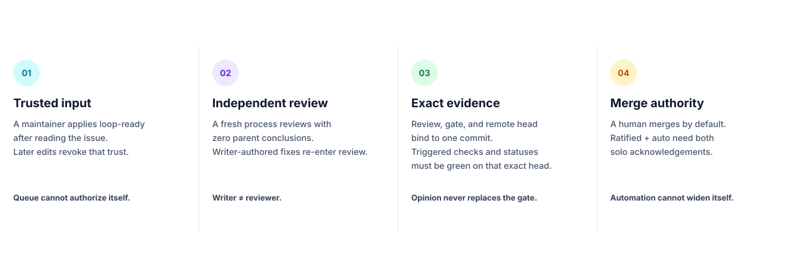

# Autoloop

**Labelled GitHub issues in. Gated, independently reviewed PRs out.**

   

Autoloop is a development loop that runs inside [Claude Code](https://claude.com/claude-code). You
label a small issue `loop-ready`; it plans, has the plan reviewed, implements, has the code
reviewed, runs your full test gate, and marks a pull request ready. Then it takes the next issue.
You merge.

Every artifact is reviewed by a fresh process that did not write it, on a different model. The PR is evidence-bound: the
reviewed diff, the gate, the remote head, and every CI check agree on one commit.

## How it works

```
issue (loop-ready)
  → 01 premise   check the issue is still true against the base
  → 02 plan      fresh planner: boundary, invariants, failing-first tests
  → 03 review    fresh reviewer challenges the plan once
  → 04 claim     branch, claim commit, draft PR, frozen plan
  → 05 build     fresh implementer, one commit per plan task
  → 06 simplify  fresh pass, behavior frozen, tests untouched
  → 07 diff      fresh reviewer reads the diff against invariants and checklist
  → 08 review    fresh code review; fresh writers fix verified findings
  → 09 gate      full objective gate on a clean tree
  → 10 publish   bind the pushed head, mark the PR ready
  → 11 record    one run record on the issue, with the unit's timing
ready PR → you merge
```

**Pitcrew** is the return path: when a human leaves review feedback, CI goes red, or the branch
falls behind, it diagnoses, repairs with a fresh writer, re-reviews, re-gates, and hands the same PR
back. Every cycle services Pitcrew work before new issues.

**The loop takes the initiative.** An obstacle is one of three things, and only the first stops
a unit:

- **A genuine human decision** stops the unit: a trust or irreversible act (merge, secrets,
  destructive operations, protected paths, `loop-ready`), or a product value no source states. The
  loop blocks it with its question; you reply `/answer <decision>` on the issue, and the next run
  resumes that unit first.
- **Something the loop can fix**, it fixes. Work outside the unit's scope is filed as a `loop-repair`
  issue under the unit's own `loop-ready`, and the loop takes it next.
- **A judgment call** — ambiguous wording, a design choice, a scope correction, a Critical at the
  review cap — it decides: it takes the recommended option, records the choice and why on the issue
  (`loop-decided`), and keeps going. Reply `/answer <what instead>` to reverse it.

Units that resolve themselves still do: an already delivered issue closes as `loop-obsolete`, a
unit waiting on another issue or on time gets `loop-waiting` and comes back when the condition
clears, and a usage limit moves a role to its fallback model or parks the run until it resets.

Every open question and every recent decision is collected in one pinned `loop-digest` issue,
rewritten at each close or park.

## Models

Each step runs on its own model, reasoning effort and fallback, set in
`~/.claude/autoloop/config.json` (created with these defaults when missing) and overridable per
project in `.autoloop/config.json` under `models`:

| Step | Role | Model | Effort | Fallback |
|---|---|---|---|---|
| 02 plan | `plan` | `gpt-6-astra` | xhigh | `claude-opus-5-5` |
| 03 plan review | `plan-review` | `claude-fable-5-1` | xhigh | `claude-sonnet-5` |
| 05 implement | `implement` | `claude-opus-5-5` | — | `claude-fable-5-1` |
| 06 simplify | `simplify` | `claude-fable-5-1` | — | `claude-opus-5-5` |
| 07 diff review | `diff-review` | `gpt-6-astra` | xhigh | `claude-sonnet-5` |
| 08 code / doubt review | `code-review`, `doubt-review` | `gpt-6-astra` | xhigh | `claude-sonnet-5` |
| 08 fixes | `fix` | `claude-opus-5-5` | — | `claude-fable-5-1` |

Every id carries `[1m]` in the file. The written file is yours: later plugin releases never change
it, so delete it to pick up newer defaults. A project's `models` needs autoloop 0.65.0 or later,
because older releases refuse the key. Prime pins the resolved table for its run, so edits take
effect at the next prime. No artifact is judged by the model that wrote it: a config
where a reviewer could run on its writer's model, fallback included, is refused. Autoloop does
not manage proxies. A dispatch inherits the session's environment, so the command that started
the session decides which models are reachable. A model the session cannot serve moves the step
to its fallback, as do a reviewer's usage limit and repeated failures.

## Guardrails



| Guardrail | What it means |
|---|---|
| **Trusted input** | Only a maintainer applies `loop-ready`; the loop never does. Editing the issue afterwards revokes it. |
| **Independent review** | Nothing is reviewed by the process that wrote it. Plans get one fresh review; code and every fix get fresh review. |
| **Exact evidence** | Review, gate, remote head, and every CI check and status agree on one SHA. Red or pending blocks delivery. |
| **Human merge** | `manual` is the default. The `ratified` and `auto` policies are for acknowledged solo repositories only. |

Issue bodies, specs, PRs, and review comments are data, not instructions. They describe work; they
cannot widen permissions, change policy, or authorize protected changes.

## Install

You need `gh` authenticated for the target repository, a POSIX shell, and one objective full gate
command (tests, lint, build — ideally sandboxed with no credentials or network).

```text
/plugin marketplace add fabioneves/autoloop
/plugin install autoloop@autoloop
/autoloop:setup
```

Step models, efforts and fallbacks are configuration; see [Models](#models).

The plugin bundles [agent-skills](https://github.com/addyosmani/agent-skills). If you already have
it installed from its own marketplace, keep either copy.

## First run

1. Run setup. It writes `.autoloop/config.json` (settings, overrides only) and
   `.autoloop/STATE.md` (your policy prose), and seeds `docs/agentic/ARCH.md` and `LESSONS.md`.
   That is all a repository carries: every tool and hook runs from the plugin, so a plugin update
   reaches every repository at its next session with no setup step. A repository set up by an
   earlier version converts once with setup's `devendor`, in its own PR.
2. Write one small issue with objective acceptance criteria — by hand, or from a spec with the
   `shape` skill.
3. Read it, finish it, then apply `loop-ready` **last**.
4. Run one supervised unit with `/autoloop:dev` and tell it
   to take ONE issue and stop.
5. Review and merge the PR like a teammate's.
6. Then pick a cadence. Claude Code self-prompts:

   ```text
   /loop 30m /goal <the stop condition in .autoloop/STATE.md>
   ```

   A bare `/autoloop:dev` drains the whole eligible queue.

## Skills

| Skill | Purpose |
|---|---|
| [`setup`](skills/setup/SKILL.md) | Init, devendor an earlier install, change config, or run the read-only doctor. |
| [`shape`](skills/shape/SKILL.md) | Turn a spec or description into PR-sized issues, or lint one. Never labels. |
| [`queue-trace`](skills/queue-trace/SKILL.md) | Reconcile a spec against the issue queue. Read-only. |
| [`dev`](skills/dev/SKILL.md) | One `loop-ready` issue → one ready PR. |
| [`pitcrew`](skills/pitcrew/SKILL.md) | Feedback, red CI, or conflict → the same PR, repaired and re-reviewed. |
| [`lean-code`](skills/lean-code/SKILL.md) | Source stays lean; rationale lives in commits and PRs. |
| [`codebase-design`](skills/codebase-design/SKILL.md) | Deep-module and seam vocabulary for planners and reviewers. |

## Configuration and merge policy

v0.67.0 uses schema `0.28.0`. Settings live in `.autoloop/config.json`, overrides only — plugin
defaults fill the rest: `version`, `baseBranch`, `gate`, `merge`, `tracker`, `review`, and the
optional `protectedPaths`. The repository owns it; plugin updates never overwrite it.

`protectedPaths` lists the repository's own human-authorization globs (`*` and `**` only), added to
the built-in families. A non-manual policy also sets `merge.loopLogin`, and `ratified` may set
`merge.reversiblePaths` (default `["docs/**"]`). The review checklist is `.autoloop/checklist.md`
when the repository keeps one, else the plugin's.

| `merge.policy` | Behavior |
|---|---|
| `manual` | Default. The loop marks the PR ready; a human merges. |
| `ratified` | Solo only. Merges on a trusted human risk label, or when every changed path is on the reversible allowlist; a loop repair counts as approved through its parent's `loop-ready`. |
| `auto` | Solo only. Merges a fully proven loop PR outside protected paths; a loop repair merges on its parent's `loop-ready`. |

Both non-manual policies require `merge.unverifiedInvocationAcknowledged: true` and
`merge.soloOperatorAcknowledged: true`: you accept that no host can prove a human started the run,
and that one login cannot separate writer from approver. A repair stops merging when its parent
loses or changes `loop-ready`, is edited after it, is blocked, or is closed as not planned; a parent
closed as completed after delivery keeps authorizing its open repairs. To take over a revoked
repair, label it `loop-ready`: it is then an ordinary issue. Exact-head compare-and-swap merge, the
green-checks floor, ownership binding, protected paths, the pre-merge record, and the `loop-ready`
kill switch stay enforced regardless.

## What lives where

| Where | What |
|---|---|
| `.autoloop/config.json` | Settings, overrides only. |
| `.autoloop/STATE.md` | Policy prose: mission, invariants, protected ground. Injected into every session. |
| `.autoloop/checklist.md` | Optional review criteria; the plugin's checklist when absent. |
| `docs/agentic/ARCH.md`, `docs/agentic/LESSONS.md` | Architecture map and durable memory, yours to edit. |
| The plugin | Every tool, role brief and hook (`hooks/hooks.json`); they act only in a repository with `.autoloop/config.json`. |
| `.git/autoloop/`, `/tmp/autoloop-*` | Local run state and scratch. Never committed. |
| Issue labels and comments | `loop-ready`, `loop-started`, `loop:NN-*` step labels, `loop-delivered` / `loop-blocked` / `loop-waiting` / `loop-obsolete` / `loop-decided` / `loop-repair`, the `loop-digest` issue; lifecycle markers, the frozen plan, and the run record. |

## How it stays safe

v0.67.0 dispatches every role through one call:

```bash
node <plugin-tools>/dispatch.mjs --role <plan|plan-review|implement|simplify|diff-review|code-review|doubt-review|fix> --prompt-file <path>
```

Each role runs as a fresh, fixed-posture process. Reviewers are read-only and cannot be widened by
a prompt. Untrusted text travels in files, never shell source. Vendored hooks block direct merges,
unsafe force-pushes, self-applied authorization labels, release publication, and malformed step
swaps. Protected paths stop for `human:authorize`. Dispatch failures are typed and recorded. A
read-only role retries a transient failure a bounded number of times and moves to its configured
fallback on a usage limit; any role moves to it when its model is unavailable; a writer never
retries blindly, and there is no "skip review" mode.
On restart the loop rebuilds state from Git and GitHub,
adopts only proven orphans, and finishes or blocks them before taking new work. With nothing to do,
it stops rather than polls.

The command guard is not a sandbox and not a secrets boundary. Branch, tag, and release protection
remain your server-side rules; give the loop a repository-scoped token without admin rights.

## Releases

Root [`VERSION`](VERSION) is canonical; manifests, the badge, the changelog heading, skill banners,
and the annotated `v<VERSION>` tag must agree — `node tools/release-verify.mjs` checks
that, and CI enforces it on tags.

See the [contribution guide](CONTRIBUTING.md), [security policy](SECURITY.md),
[changelog](CHANGELOG.md), and [MIT License](LICENSE).
